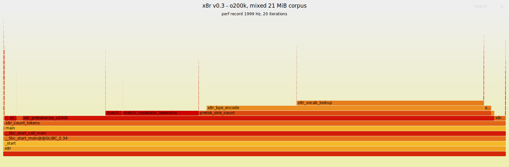
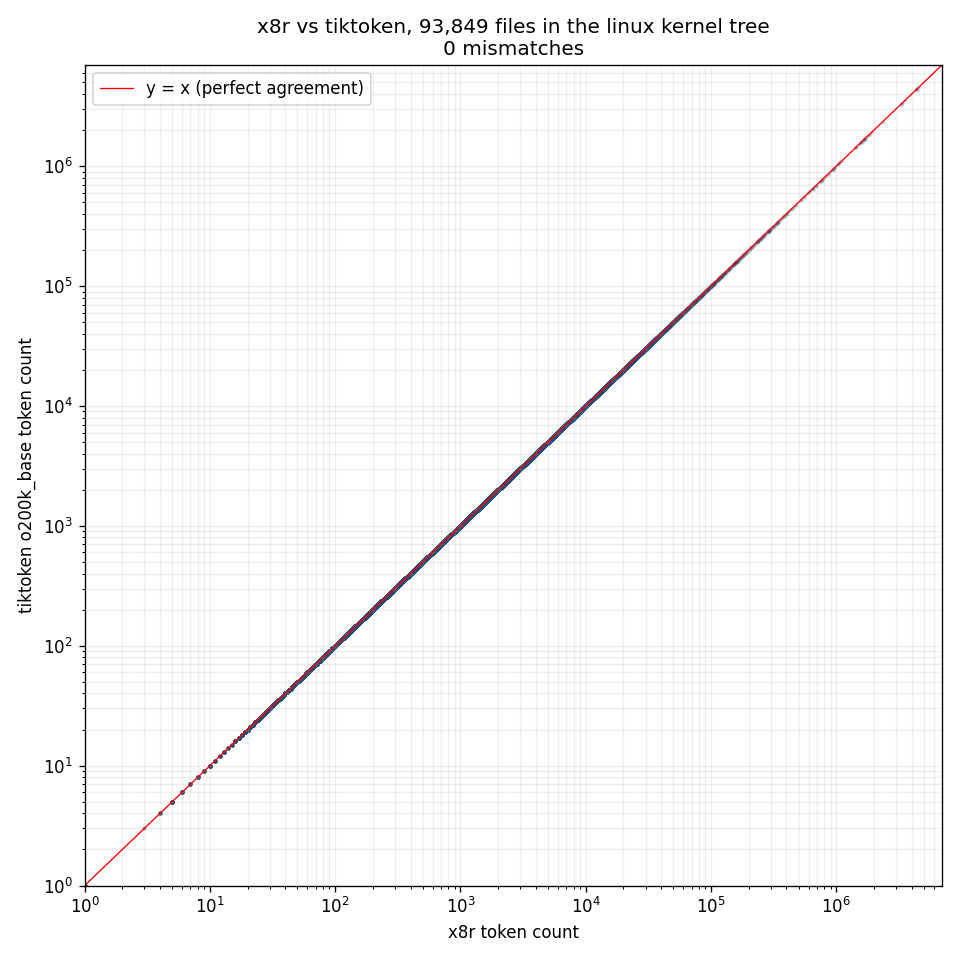

# x8r

a native byte-level BPE tokenizer + chunker. does two things:

1. count tokens in a file, bit-exact vs `tiktoken`
2. split a file into chunks of <= N tokens, cut at decent boundaries

built because tokenizing is on the hot path for LLM agent tooling and
`tiktoken` in python gets expensive once you're calling it per-file on a
monorepo.

linux x86_64 only. AVX2 required. cl100k and o200k vocabs supported.

## why

agents read files in token budgets, not bytes. every `Read` call has
to answer "how many tokens is this" and "if i can only afford N, where
do i cut". python `tiktoken` is fine for one-shot, painful at scale.
nothing else combines byte-accurate BPE with boundary-aware chunking.

## speed

warm, single-threaded, vs `tiktoken.encode_ordinary` (o200k):

| file                  | size   | x8r     | tiktoken | speedup |
|-----------------------|--------|---------|----------|---------|
| ascii\_code\_large    | 1 MiB  | 18.9 ms | 221.7 ms | 11.8x   |
| json\_large           | 1 MiB  | 13.9 ms | 227.2 ms | 16.3x   |
| markdown\_large       | 1 MiB  | 17.6 ms | 172.6 ms | 9.8x    |
| utf8\_prose\_large    | 1 MiB  | 15.9 ms | 114.6 ms | 7.2x    |

cl100k numbers are similar. full bench in `bench/run.py`.

## profile

flamegraph of a 21 MiB mixed corpus run, `perf record` at 1999 Hz:



top functions by self-time:

| %      | function                      | what it does                            |
|-------:|-------------------------------|-----------------------------------------|
| 38.07% | `x8r_vocab_lookup`            | FNV-1a hash + open-addressing probe     |
| 19.24% | `x8r_bpe_encode`              | BPE merge loop                          |
| 16.93% | `match_upperstar_lowerplus`   | o200k CamelCase state machine (alt 1)   |
| 15.89% | `x8r_pretokenize_o200k`       | top-level pretok driver                 |
|  4.74% | `match_upperplus_lowerstar`   | o200k CamelCase state machine (alt 2)   |
|  2.44% | `pretok_sink_count`           | token-count accumulator callback        |
|  2.06% | `x8r_scan_ascii_space`        | AVX2 whitespace scan                    |

useful mental model: pretok work (~40%) + vocab hash (~38%) + merge
loop (~19%) = ~97% of runtime. the AVX2 ASCII fast-paths are already
small enough to be uninteresting.

## build

```sh
make
```

produces:
- `build/x8r`        cli
- `build/libx8r.so`  shared lib
- `build/libx8r.a`   static lib

vocab blobs ship in `vocab/cl100k.bin` and `vocab/o200k.bin`. they are
flat hashed dumps of the tiktoken mergeable ranks, built by
`scripts/dump_cl100k.py` and `scripts/dump_o200k.py`.

## cli

```
x8r [options] <file>
x8r [options] -         # stdin

--count             just print the token count
--budget N          chunk into <= N tokens each
--model NAME        cl100k | o200k | auto (default: trust vocab blob)
--vocab PATH        vocab file (default: $X8R_VOCAB or ./vocab/cl100k.bin)
--boundary MODE     none | line | auto (default: line)
--tolerance F       how far back to search for a boundary (default: 0.10)
--json              machine-readable output
```

### examples

```sh
# count
x8r --count src/main.c

# count with a specific vocab
X8R_VOCAB=vocab/o200k.bin x8r --count README.md

# chunk into 4000-token pieces, cut at line boundaries
x8r --budget 4000 big_file.txt

# same, as JSON
x8r --budget 4000 --json big_file.txt
```

chunk output is one line per chunk: `start_byte end_byte token_count
cut_kind`.

## c abi

```c
#include "x8r.h"

x8r_ctx *ctx;
x8r_ctx_open("vocab/o200k.bin", X8R_VOCAB_AUTO, &ctx);

size_t n = x8r_count_tokens(ctx, buf, len);

x8r_opts opts = { .budget = 4000, .boundary = X8R_BOUNDARY_LINE,
                  .tolerance = 0.10 };
x8r_chunk *chunks; size_t nchunks;
x8r_chunk_buf(ctx, buf, len, &opts, &chunks, &nchunks);

x8r_chunks_free(chunks);
x8r_ctx_close(ctx);
```

see `include/x8r.h`.

## how it works

- mmap the file, madvise sequential
- pretokenize: classify bytes/codepoints (letter/digit/space/punct/newline
  plus upper/lower/mark for o200k CamelCase splits). AVX2 hot loop for
  the ASCII fast path, scalar fallback for UTF-8
- BPE merge: FNV-1a hash, open-addressing table, load ~0.38
- chunk: binary-search the cumulative token array for the largest prefix
  <= budget, walk back through boundary candidates within tolerance

unicode class lookup is a two-stage table generated from python's
`regex` module (not `unicodedata`, since tiktoken's rust regex engine
classifies unassigned-but-block-allocated codepoints as `\p{L}` the
same way `regex` does).

## correctness

- differential fuzzer (`scripts/fuzz_vs_tiktoken.py`) with five flavors
  and a bisect-shrinker. 10k cases clean on both vocabs.
- golden token counts match tiktoken exactly on all bench corpora.
- **linux kernel tree**: tokenized every non-binary file in a shallow
  clone of `torvalds/linux` (93,849 files, 487M tokens across `.c`,
  `.h`, `.rst`, `.dts`, `.yaml`, assembly, shell, python, rust, etc)
  and compared against `tiktoken.encode_ordinary` with `o200k_base`.
  zero mismatches.



known divergence: a tiny set of unicode codepoints (unassigned, inside
script blocks) where tiktoken's public `encode_ordinary` and its own
internal `_encode_only_native_bpe` disagree with each other. x8r matches
the latter. real text never hits this. see comment in
`src/pretok_o200k.c`.

## what it is not

- not a trainer. vocabs are fixed tiktoken dumps.
- not a general regex engine. the pretokenizer is hand-rolled for the
  specific tiktoken patterns.
- not a drop-in tiktoken replacement in-process. subprocess CLI or
  `libx8r.so` via dlopen.
- no ARM build, no windows build, no AVX-512 path yet.

## layout

```
include/x8r.h              public c abi
src/main.c                 cli
src/chunk.c                public api, budget search, boundary picker
src/pretok_scalar.c        cl100k pretokenizer (scalar)
src/pretok_avx2.c          cl100k pretokenizer (AVX2 ascii fast path)
src/pretok_o200k.c         o200k pretokenizer (scalar, CamelCase-aware)
src/bpe.c                  merge loop + vocab hash
src/vocab.c                vocab load/mmap
src/mmap_io.c              mmap wrapper
src/unicode_tables.h       generated, codepoint class bits
vocab/cl100k.bin           199K tokens, ~2.2 MiB
vocab/o200k.bin            200K tokens, ~4.5 MiB
scripts/                   vocab dump, unicode table gen, fuzzer
bench/                     cold+warm bench harness
```

## techniques borrowed

x8r is mostly small, well-known tricks put together for one narrow job.
if you want to go deeper on any of the pieces:

- **VPMOVMSKB + TZCNT class scans** — used in `x8r_scan_ascii_letter`
  and `x8r_scan_ascii_space`. background:
  [Wojciech Muła, SIMD byte lookup (PSHUFB)](http://0x80.pl/notesen/2018-10-18-simd-byte-lookup.html) and
  [Daniel Lemire, ridiculously fast UTF-8 validation](https://lemire.me/blog/2020/10/20/ridiculously-fast-unicode-utf-8-validation/).
- **signed-domain ASCII letter range check** — `(c|0x20) - 'a' < 26`
  done as a single `_mm256_cmpgt_epi8` after shifting by `0x80`.
  standard move in Muła's byte-class posts above.
- **karpathy's "Let's build the GPT Tokenizer"** for the BPE model in
  general:
  [video](https://www.youtube.com/watch?v=zduSFxRajkE).
- **tiktoken** for the reference behavior we match against:
  [github.com/openai/tiktoken](https://github.com/openai/tiktoken).
- **BPE original paper** — Sennrich, Haddow, Birch 2016:
  [arxiv.org/abs/1508.07909](https://arxiv.org/abs/1508.07909).
- **two-stage Unicode class table** — standard ICU/unicode-rs pattern,
  not from a specific post.

techniques considered but not used (because the profile didn't justify
them yet): Lemire/Keiser SIMD UTF-8 validation, Langdale-style
bits-to-indexes via BMI2, abseil SwissTable group scans for the vocab
hash, runtime ifunc dispatch. see the flamegraph for why these aren't
urgent.

## license

MIT. see `LICENSE`.
